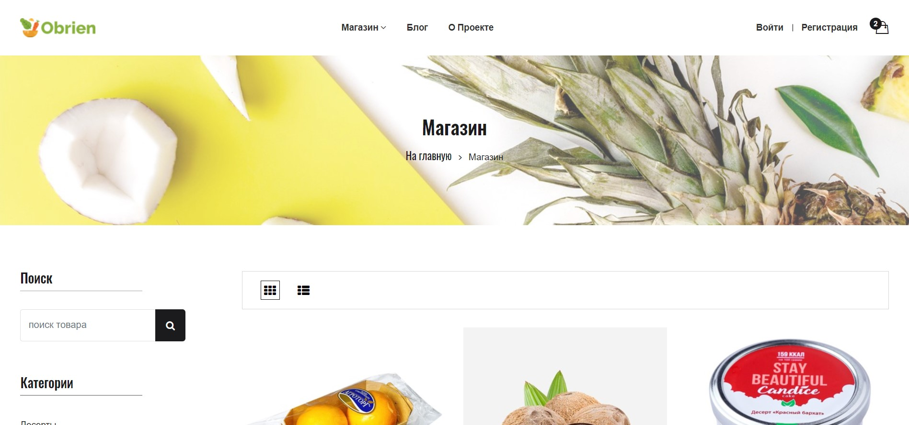

<h1>Foodshop Obrien</h1>
Проект создавался в целях закрепления материала по Django и вёрстке:)
Реализовано : авторизация/аутентификация, микро-блог с постами, сам магазин: товары по категориям, пагинация, поиск товаров, корзина.

Проект задеплоен на python-anywhere, посмотреть можно здесь: <h4>http://obrienshop.pythonanywhere.com/</h4>


<h2>Используемые технологии</h2>
<li>Django 2.2</li>
<li>Python 3.8</li>
<li>SQLite</li>
<li>HTML/CSS</li>
<h2>Установка проекта:</h2>

### Клонируйте данный репозиторий
```git clone https://github.com/Viktrols/food-shop```
### Создайте и активируйте виртуальное окружение
```
python -m venv venv<br>
source ./venv/Scripts/activate  #для Windows
source ./venv/bin/activate      #для Linux и macOS
```
### Установите требуемые зависимости
```
pip install -r requirements.txt
```
### Примените миграции
```
python manage.py migrate
```
### Соберите статику
```
python manage.py collectstatic
```
### Запустите django-сервер
```
python manage.py runserver
```

### Приложение будет доступно по адресу: http://127.0.0.1:8000/
